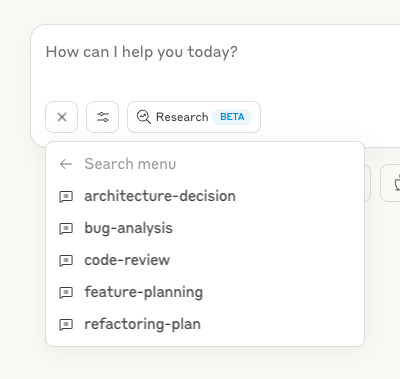

# Code Reasoning MCP Server

A Model Context Protocol (MCP) server that enhances Claude's ability to solve complex programming tasks through structured, step-by-step thinking.

<a href="https://glama.ai/mcp/servers/@mettamatt/code-reasoning">
  
</a>

[](https://www.npmjs.com/package/@mettamatt/code-reasoning)
[](https://opensource.org/licenses/MIT)
[](https://github.com/mettamatt/code-reasoning/actions/workflows/ci.yml)

## Quick Installation

1. Configure Claude Desktop by editing:

   - macOS: `~/Library/Application Support/Claude/claude_desktop_config.json`
   - Windows: `%APPDATA%\Claude\claude_desktop_config.json`
   - Linux: `~/.config/Claude/claude_desktop_config.json`

   ```json
   {
     "mcpServers": {
       "code-reasoning": {
         "command": "npx",
         "args": ["-y", "@mettamatt/code-reasoning"]
       }
     }
   }
   ```

2. Configure VS Code:

```json
{
  "mcp": {
    "servers": {
      "code-reasoning": {
        "command": "npx",
        "args": ["-y", "@mettamatt/code-reasoning"]
      }
    }
  }
}
```

## Usage

1. To trigger this MCP, append this to your chat messages:

   ```
   Use sequential thinking to reason about this.
   ```

2. Use ready-to-go prompts that trigger Code-Reasoning:



- Click the "+" icon in the Claude Desktop chat window, or in Claude Code type `/help` to see the specific commands.
- Select "Add from Code Reasoning" from the available tools
- Choose a prompt template and fill in the required information
- Submit the form to add the prompt to your chat message and hit return

See the [Prompts Guide](./docs/prompts.md) for details on using the prompt templates.

## Command Line Options

- `--debug`: Enable detailed logging
- `--help` or `-h`: Show help information

## Key Features

- **Programming Focus**: Optimized for coding tasks and problem-solving
- **Structured Thinking**: Break down complex problems into manageable steps
- **Thought Branching**: Explore multiple solution paths in parallel
- **Thought Revision**: Refine earlier reasoning as understanding improves
- **Safety Limits**: Automatically stops after 20 thought steps to prevent loops
- **Ready-to-Use Prompts**: Pre-defined templates for common development tasks

## Documentation

Detailed documentation available in the docs directory:

- [Usage Examples](./docs/examples.md): Examples of sequential thinking with the MCP server
- [Configuration Guide](./docs/configuration.md): All configuration options for the MCP server
- [Prompts Guide](./docs/prompts.md): Using and customizing prompts with the MCP server
- [Testing Framework](./docs/testing.md): Testing information

## Project Structure

```
├── index.ts                  # Entry point
├── src/                      # Implementation source files
└── test/                     # Testing framework
```

## Prompt Evaluation

The Code Reasoning MCP Server includes a prompt evaluation system that assesses Claude's ability to follow the code reasoning prompts. This system allows:

- Testing different prompt variations against scenario problems
- Verifying parameter format adherence
- Scoring solution quality
- Generating comprehensive reports

To use the prompt evaluation system, run:

```bash
npm run eval
```

### Prompt Comparison and Development

Significant effort went into developing the optimal prompt for the Code Reasoning server. The current implementation uses the HYBRID_DESIGN prompt, which emerged as the winner from our evaluation process.

We compared four different prompt designs:

| Prompt Design       | Description                                                          |
| ------------------- | -------------------------------------------------------------------- |
| SEQUENTIAL          | The original sequential thinking prompt design                       |
| DEFAULT             | The baseline prompt previously used in the server                    |
| CODE_REASONING_0_30 | An experimental variant focusing on code-specific reasoning          |
| HYBRID_DESIGN       | A refined design incorporating the best elements of other approaches |

Our evaluation across seven diverse programming scenarios showed that HYBRID_DESIGN outperformed other prompts:

| Scenario                   | HYBRID_DESIGN | CODE_REASONING_0_30 | DEFAULT | SEQUENTIAL |
| -------------------------- | ------------- | ------------------- | ------- | ---------- |
| Algorithm Selection        | 87%           | 82%                 | 88%     | 82%        |
| Bug Identification         | 87%           | 91%                 | 88%     | 92%        |
| Multi-Stage Implementation | 83%           | 67%                 | 79%     | 82%        |
| System Design Analysis     | 82%           | 87%                 | 78%     | 82%        |
| Code Debugging Task        | 92%           | 87%                 | 92%     | 92%        |
| Compiler Optimization      | 83%           | 78%                 | 67%     | 73%        |
| Cache Strategy             | 86%           | 88%                 | 82%     | 87%        |
| **Average**                | **86%**       | **83%**             | **82%** | **84%**    |

The HYBRID_DESIGN prompt marginally demonstrated both the highest average solution quality (86%) and the most consistent performance across all scenarios, with no scores below 80%. It also prodouced the most thoughts. The `src/server.ts` file has been updated to use this optimal prompt design.

Personally, I think the biggest improvement was adding this to the end of the prompt: "✍️ End each thought by asking: "What am I missing or need to reconsider?"

See [Testing Framework](./docs/testing.md) for more details on the prompt evaluation system.

## License

This project is licensed under the MIT License. See the LICENSE file for details.
