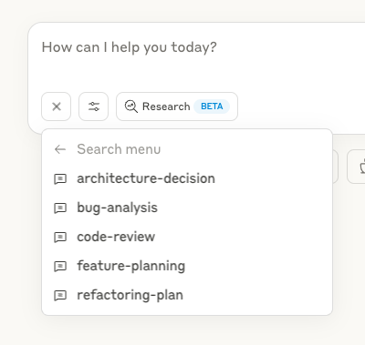

# Code Reasoning MCP Server

A Model Context Protocol (MCP) server that enhances Claude's ability to solve complex programming tasks through structured, step-by-step thinking.

<a href="https://glama.ai/mcp/servers/@mettamatt/code-reasoning">
  
</a>

[](https://www.npmjs.com/package/@mettamatt/code-reasoning)
[](https://opensource.org/licenses/MIT)
[](https://github.com/mettamatt/code-reasoning/actions/workflows/ci.yml)

## Quick Installation

1. Configure Claude Desktop by editing:
   - macOS: `~/Library/Application Support/Claude/claude_desktop_config.json`
   - Windows: `%APPDATA%\Claude\claude_desktop_config.json`
   - Linux: `~/.config/Claude/claude_desktop_config.json`

   ```json
   {
     "mcpServers": {
       "code-reasoning": {
         "command": "npx",
         "args": ["-y", "@mettamatt/code-reasoning"]
       }
     }
   }
   ```

2. Configure VS Code:

```json
{
  "mcp": {
    "servers": {
      "code-reasoning": {
        "command": "npx",
        "args": ["-y", "@mettamatt/code-reasoning"]
      }
    }
  }
}
```

## Usage

1. To trigger this MCP, append this to your chat messages:

   ```
   Use sequential thinking to reason about this.
   ```

2. Use ready-to-go prompts that trigger Code-Reasoning:



- Click the "+" icon in the Claude Desktop chat window, or in Claude Code type `/help` to see the specific commands.
- Select "Add from Code Reasoning" from the available tools
- Choose a prompt template and fill in the required information
- Submit the form to add the prompt to your chat message and hit return

See the [Prompts Guide](./docs/prompts.md) for details on using the prompt templates.

## Command Line Options

- `--debug`: Enable detailed logging
- `--help` or `-h`: Show help information

## Key Features

- **Programming Focus**: Optimized for coding tasks and problem-solving
- **Structured Thinking**: Break down complex problems into manageable steps
- **Thought Branching**: Explore multiple solution paths in parallel
- **Thought Revision**: Refine earlier reasoning as understanding improves
- **Safety Limits**: Automatically stops after 20 thought steps to prevent loops
- **Ready-to-Use Prompts**: Pre-defined templates for common development tasks

## Documentation

Detailed documentation available in the docs directory:

- [Usage Examples](./docs/examples.md): Examples of sequential thinking with the MCP server
- [Configuration Guide](./docs/configuration.md): All configuration options for the MCP server
- [Prompts Guide](./docs/prompts.md): Using and customizing prompts with the MCP server
- [Testing Framework](./docs/testing.md): Testing information

## Project Structure

```
├── index.ts                  # Entry point
├── src/                      # Implementation source files
└── test/                     # Placeholder for future test utilities
```

## License

This project is licensed under the MIT License. See the LICENSE file for details.
